[TOC]

# Ejercicio 2 - Docker Compose

## Explorar la imagen de la aplicación FileBrowser

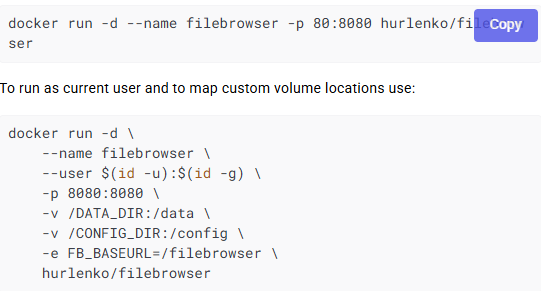

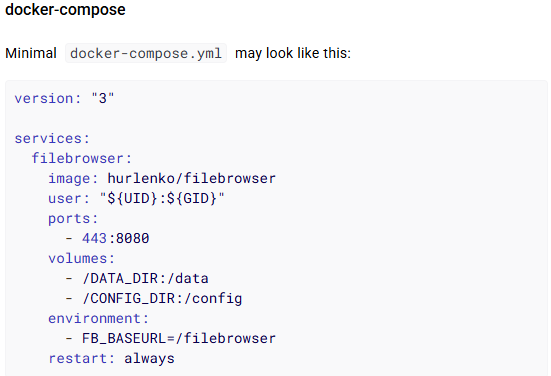

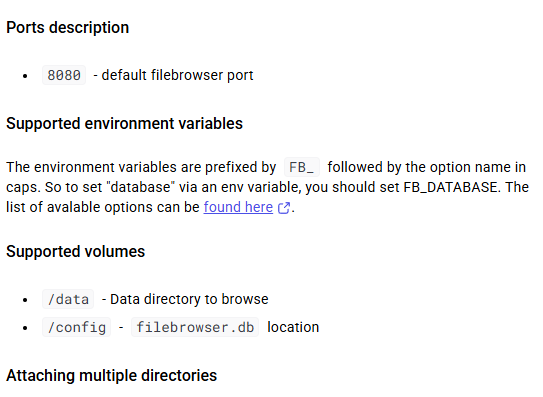

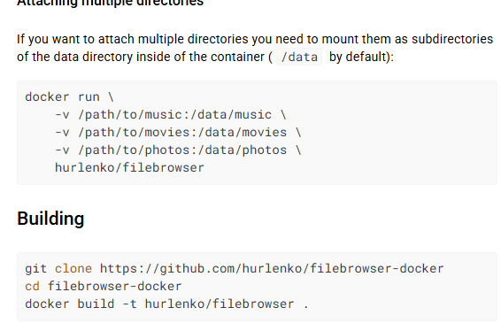

Esto son los datos de los que vamos a sacar la información para realizar

De aquí debemos sacar la información:

- nombre de la imagen: hurlenko/filebrowser
- puerto : 8080
- volumenes: /data y /config

## Captura de pantalla y documento donde se vea el fichero dockercompose yaml que has creado.

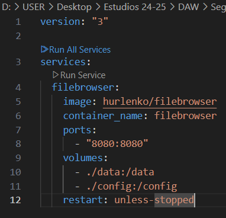

A continuación creamos en un editor de texto el archivo .yaml con el que utilizaremos para lanzar el contenedor

Descripción: 

- versión  - Indica la versión del esquema Docker Compose
- filebrowser - Nombre del servicio
- image - es la imagen de Docker que usamos
- container_name - nombre que le damos al contenedor

- ports- indicas que puerto del contenedor se debe conectar a que puerto de la máquina
- volumes - Creas el vínculo entre carpetas locales y rutas dentro del contenedor con esto estamos realizando **bind-mount**
- restart: unless-stopped - reinicia este contenedor automáticamente si se apaga, a no ser que lo apague yo

A continuación en Git-Bash escrbimos el comando `docker compose up -d` para lanzar el contenedor por comandos

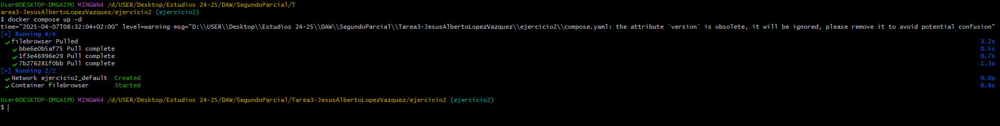

## Captura de pantalla donde se vean los volúmenes/carpetas donde se han almacenado los datos

Comprobamos que realmente se ven las carpetas donde se almacenan los datos

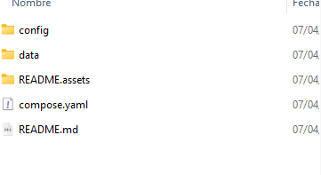

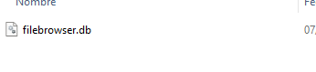

Podemos comprobar que efectivamente tenemos **data y config**

A continuación en el navegador escribimos localhost:8080 y entraremos en el panel de login de **FileBrowser** 

## Captura de pantalla donde se vea la aplicación funcionando, sube algún fichero, cambia el lenguaje a español...

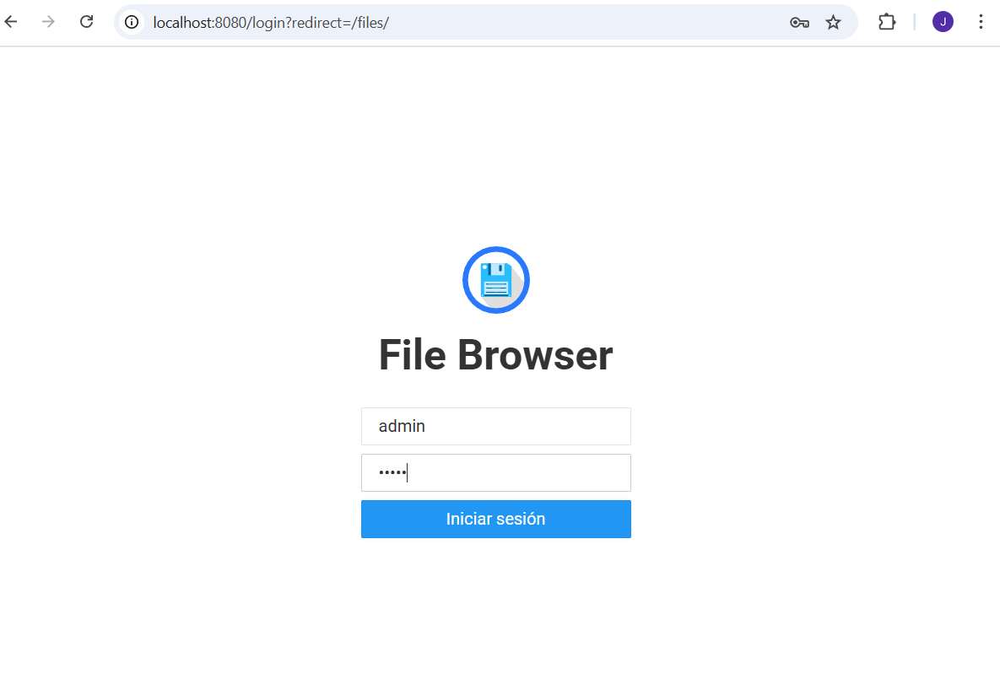

Cambiamos el idioma a español

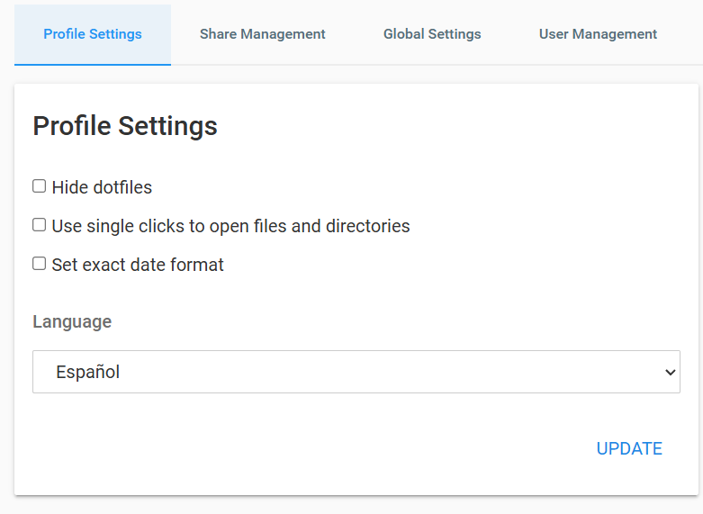

Creo un archivo en mi ordenador y a continuación en la flecha de subir de la aplicación exploro por mi ordenador hacia la ubicación del archivo y la subo

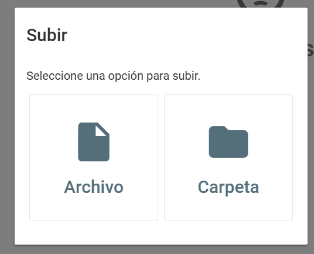

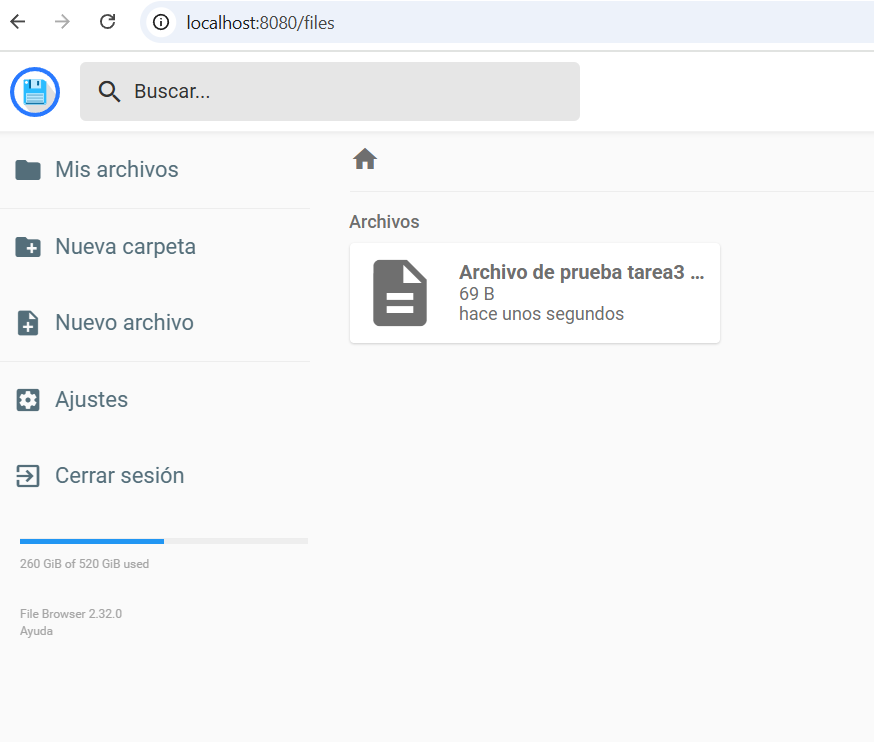

Por último desde mi ordenador nos dirigimos a data para comprobar que efectivamente el archivo se ha guardado en data.

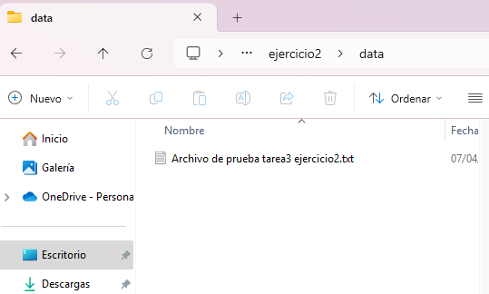

## Explicar brevemente cómo funciona esta aplicación y qué hace. 

Esta aplicación que esta creada con docker lo que permite no tenerla instalada en nuestro equipo sino acceder a ella desde el navegador, nos permite manejar archivos de nuestro equipo desde el navegador, lo que nos da muchas posibilidades,, ya que esto nos permite añadir , borrar o editar archivos desde cualquier otro dispositivo que este conectado a internet.

Con la configuración adecuada podríamos acceder a archivos subidos a FileBrowser desde nuestro móvil, en esta práctica los archivos se almacenan en carpeta local gracias al uso de bind-mounts.
